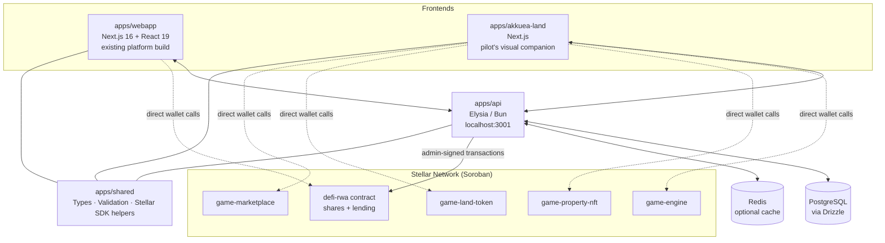
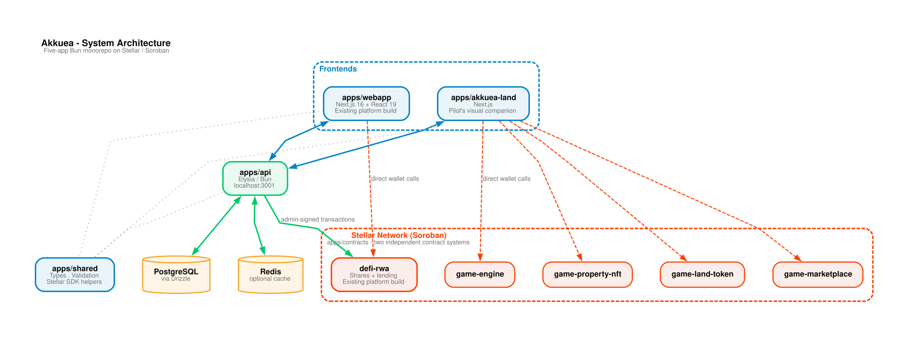
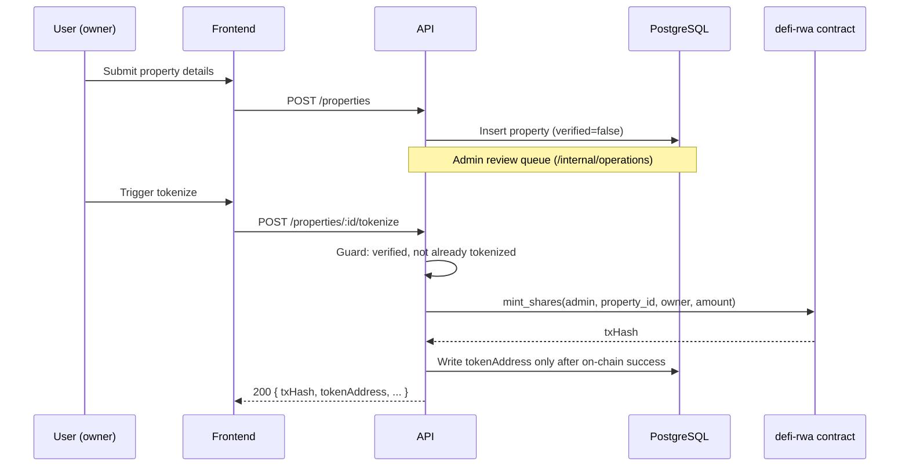
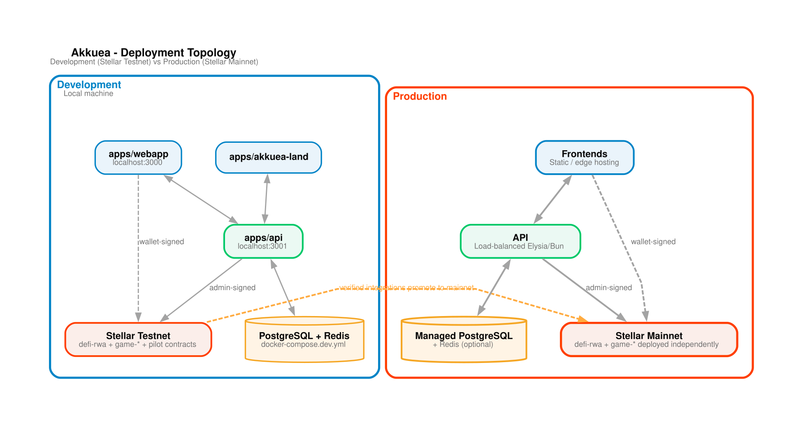

# System Architecture

> This document describes the **existing platform build** - the monorepo as it exists today, including both the fractional-shares/lending platform and Akkuea Land. For _why_ the pilot uses a different, smaller contract surface than the `defi-rwa` contract described here, see [`docs/strategy/product-brief.md`](../strategy/product-brief.md#relationship-to-the-existing-platform-build).

## Overview

Akkuea is a Bun monorepo with five applications working together: two Next.js frontends, one Elysia/Bun API, one shared TypeScript library, and one Rust/Soroban contracts workspace containing two independent contract systems.

## High-Level Architecture



Presentation version (vertical, generated by [`scripts/diagrams/`](../../scripts/diagrams/)):



Both frontends talk to the same API and share the same `@akkuea/shared` types, but each talks to its own contract system directly from the browser via a connected Stellar wallet (Freighter or equivalent) for user-signed actions, while the API holds the admin key for admin-signed actions (minting, oracle configuration, role grants).

## Component Breakdown

### 1. Web Application (`apps/webapp`) - existing platform build

**Technology Stack:** Next.js 16 (App Router), React 19, TypeScript, Tailwind CSS 4, `@stellar/stellar-sdk`, `@creit.tech/stellar-wallets-kit`.

**Responsibilities:** property browsing and tokenization UI, wallet connection, share purchase, lending pool interactions, KYC document upload, portfolio management. See [`../design-system/`](../design-system/) for the visual system this app implements.

### 2. Akkuea Land (`apps/akkuea-land`) - the pilot's visual companion

**Technology Stack:** Next.js, TypeScript, same Stellar wallet integration pattern as `apps/webapp`.

**Responsibilities:** the tile-based property game - onboarding (claim starter LAND + a starter property), dashboard (view and claim accrued rental income), city map (buy from treasury, improve, list/buy on the marketplace). See [`../game/`](../game/) and [`../strategy/product-brief.md`](../strategy/product-brief.md) for why this exists alongside the pilot.

### 3. Backend API (`apps/api`)

**Technology Stack:** Elysia (Bun runtime), TypeScript, Drizzle ORM (PostgreSQL), Zod validation, Swagger-generated docs.

**Responsibilities:** REST API for both frontends, admin-signed blockchain transaction orchestration for the `defi-rwa` contract, KYC verification workflow, property review queue, notifications, rate limiting and structured audit logging. See [`../api/overview.md`](../api/overview.md).

### 4. Smart Contracts (`apps/contracts`) - two independent systems

**Technology Stack:** Rust, Soroban SDK, WASM (`wasm32v1-none` target via `stellar contract build`).

Two separate, unrelated contract systems live in this one Rust workspace:

- **`defi-rwa`** (existing platform build) - single WASM binary exposing both property-share tokenization and DeFi lending (pools, collateral, oracle-based valuation, liquidation, emergency pause). See [`../deployment/deploy-contracts.md`](../deployment/deploy-contracts.md).
- **`game-property-nft`, `game-land-token`, `game-engine`, `game-marketplace`** (Akkuea Land) - four independently deployed and initialized contracts. See [`../deployment/deploy-game-contracts.md`](../deployment/deploy-game-contracts.md).

The pilot's own contract surface (income-participation token, whitelist, payout-split - see [`../strategy/product-brief.md`](../strategy/product-brief.md)) is being built inside this same workspace, as a third, independent system, not as a modification of `defi-rwa`.

### 5. Shared Library (`apps/shared`)

**Technology Stack:** TypeScript.

**Responsibilities:** type definitions shared between both frontends and the API, Stellar utilities, validation schemas, contract-ID resolution (`contracts.testnet.json` / `contracts.mainnet.json` / `contracts/game-contracts.testnet.json`), test factories and staging scenarios (see [`../testing/smoke-tests.md`](../testing/smoke-tests.md)).

## Data Flow Architecture

### Property Tokenization Flow (existing platform build)



Full detail: [`../api/minting-workflow.md`](../api/minting-workflow.md).

### DeFi Borrowing Flow (existing platform build)

```
User requests loan → Frontend calculates available collateral
→ API checks on-chain share balance → Contract validates collateral ratio via oracle
→ Contract disburses funds → Frontend updates lending position
```

### Akkuea Land claim flow

```
User connects wallet → Frontend builds claim_rental transaction for each claimable property
→ Wallet signs → Submitted to Soroban RPC → Polled until confirmed
→ LAND balance updates
```

Full detail: [`../deployment/deploy-game-contracts.md`](../deployment/deploy-game-contracts.md).

## Security Architecture

### 1. Authentication & Authorization

- Wallet-based authentication using Stellar Ed25519 signatures (see [`../api/authentication.md`](../api/authentication.md))
- Role-based access control on-chain for `defi-rwa` (`Admin`, `Pauser`, `EmergencyGuard`, plus reserved-but-unenforced `Oracle`/`Verifier`/`Liquidator` roles - see [`../operations/runbook-role-management.md`](../operations/runbook-role-management.md))
- Off-chain KYC state machine gating platform participation (see [`../api/kyc-workflow.md`](../api/kyc-workflow.md) for known enforcement gaps)
- Rate limiting on authentication and general API endpoints

### 2. Smart Contract Security

- Role-gated admin functions, two-step admin transfer (`transfer_admin_start` / `transfer_admin_accept`)
- 24-hour timelocked emergency pause and recovery (see [`../operations/runbook-emergency-pause.md`](../operations/runbook-emergency-pause.md))
- Configurable oracle staleness/price-floor guardrails (see [`../operations/runbook-oracle-failure.md`](../operations/runbook-oracle-failure.md))
- Event logging on-chain for audit trails

### 3. API Security

- CORS configuration scoped to known frontend origins
- Input validation and sanitization
- Admin-only endpoints gated by `OPERATIONS_BACKEND_CREDENTIAL` / `OPERATIONS_ALLOWED_WALLETS` (see [`../deployment/environment-variables.md`](../deployment/environment-variables.md))
- Secrets never committed - `STELLAR_ADMIN_SECRET` treated as a root credential

## Deployment Architecture

### Development

```
Local Machine:
├── apps/webapp    (localhost:3000)
├── apps/akkuea-land
├── apps/api       (localhost:3001)
├── PostgreSQL + Redis (docker-compose.dev.yml)
└── Stellar Testnet
```

### Production

```
├── Frontends       (static/edge hosting)
├── API             (load-balanced Elysia/Bun)
├── Database        (managed PostgreSQL)
├── Redis           (optional cache layer)
└── Stellar Mainnet (defi-rwa + game contracts, deployed independently)
```



See [`../deployment/deploy-contracts.md`](../deployment/deploy-contracts.md), [`../deployment/deploy-game-contracts.md`](../deployment/deploy-game-contracts.md), and [`../deployment/post-deploy-checklist.md`](../deployment/post-deploy-checklist.md).

## Integration Points

### External

1. **Stellar Network** - Horizon (classic ops) and Soroban RPC (contract invocations)
2. **SEP-40 price oracle** - required by `defi-rwa` for lending; see [`../operations/runbook-oracle-failure.md`](../operations/runbook-oracle-failure.md)
3. **KYC document review** - currently manual/admin-driven, no third-party KYC provider integrated (see [`../api/kyc-workflow.md`](../api/kyc-workflow.md))

### Internal

1. **`@akkuea/shared`** - types and utilities shared across all three TypeScript workspaces
2. **`@stellar/stellar-sdk`** - all frontend and API components talk to Stellar through this
3. **Drizzle ORM models** - API ↔ PostgreSQL
4. **Contract-ID JSON artifacts** (`apps/shared/src/contracts*.json`) - the single source of truth read by both the API and frontends for which contract to call, per network

## See also

- [`../strategy/product-brief.md`](../strategy/product-brief.md) - why the pilot's contract surface is separate from `defi-rwa`
- [`../design-system/`](../design-system/) - the visual/interaction system `apps/webapp` implements
- [`../deployment/`](../deployment/) - deployment guides for both contract systems
