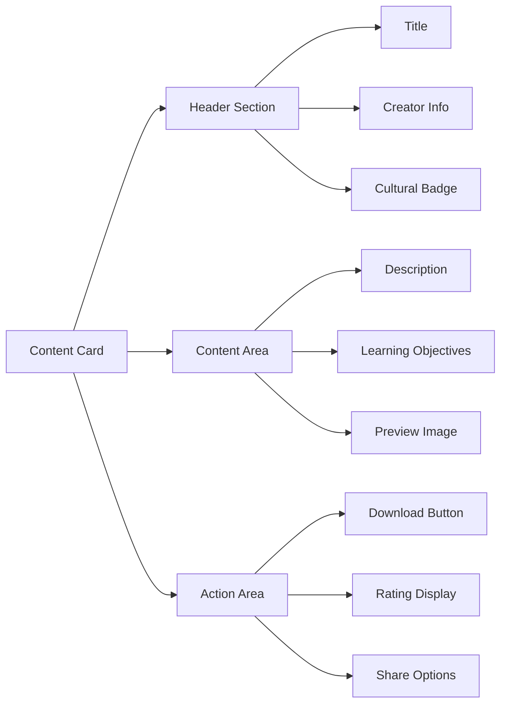

# Visual Identity & Design Guidelines

---

Issue 528

---

Issue 529

---

Issue 530

---

Issue 531

---

Issue 532

---

#### Component Architecture
```scss
// Component base class
.akkuea-component {
  font-family: var(--font-family-primary);
  color: var(--color-black);
  
  // Cultural sensitivity indicator
  &[data-cultural-content="true"] {
    border-left: 4px solid var(--color-turquoise);
    padding-left: var(--spacing-md);
  }
  
  // Accessibility enhancements
  &:focus-visible {
    outline: 2px solid var(--color-turquoise);
    outline-offset: 2px;
  }
}
```


---

#### Logo Usage Guidelines
| Context | Logo Version | Size | Colors |
|---------|-------------|------|--------|
| **Primary** | Full logo with wordmark | Min 120px wide | Black on white |
| **Reversed** | Full logo with wordmark | Min 120px wide | White on black |
| **Compact** | Symbol only | Min 32px | Black or turquoise |
| **Monochrome** | Black and white only | Any size | Pure black/white |

---

Issue 535

---

### Educational Design Principles

#### Cultural Sensitivity in Design
```mermaid
mindmap
  root)Cultural Design Principles(
    Respectful Representation
      Authentic Colors
      Traditional Patterns
      Community Input
    Inclusive Access
      High Contrast
      Clear Typography
      Universal Symbols
    Educational Context
      Learning Hierarchy
      Progressive Disclosure
      Cognitive Load Management
    Technology Integration
      Modern Interface
      Traditional Wisdom
      Balanced Approach```

---

Issue 537

---

## Component Library

### Button System

#### Button Variants
```mermaid
graph TD
    A[Button System] --> B[Primary Buttons]
    A --> C[Secondary Buttons]
    A --> D[Text Buttons]
    A --> E[Icon Buttons]
    
    B --> B1[Black background, white text]
    C --> C1[White background, black border]
    D --> D1[No background, underline on hover]
    E --> E1[Turquoise accent, minimal style]
```

---

#### Button Specifications
| Type | Background | Text Color | Border | Hover State |
|------|------------|------------|--------|-------------|
| **Primary** | `#000000` | `#FFFFFF` | None | Background: `#333333` |
| **Secondary** | `#FFFFFF` | `#000000` | 1px solid `#000000` | Background: `#F5F5F5` |
| **Accent** | `#008B8B` | `#FFFFFF` | None | Background: `#20B2AA` |
| **Text** | Transparent | `#000000` | None | Text decoration: underline |

---

### Card Components

#### Educational Content Cards


---

Issue 541

---

### Form Design

#### Input Field Standards
| State | Border | Background | Text Color | Notes |
|-------|--------|------------|------------|-------|
| **Default** | 1px solid `#CCCCCC` | `#FFFFFF` | `#000000` | Clean, accessible |
| **Focus** | 2px solid `#008B8B` | `#FFFFFF` | `#000000` | Clear focus indicator |
| **Error** | 2px solid `#DC2626` | `#FEF2F2` | `#000000` | High contrast error state |
| **Success** | 2px solid `#059669` | `#F0FDF4` | `#000000` | Positive feedback |
| **Disabled** | 1px solid `#E5E5E5` | `#F9F9F9` | `#999999` | Clear disabled state |

---

### Navigation Design

#### Primary Navigation Structure
```mermaid
graph TD
    A[Main Navigation] --> B[Platform Sections]
    A --> C[User Actions]
    A --> D[Cultural Elements]
    
    B --> B1[Discover]
    B --> B2[My Learning]
    B --> B3[Community]
    B --> B4[Marketplace]
    B --> B5[AI Agents]
    
    C --> C1[Profile Menu]
    C --> C2[Notifications]
    C --> C3[Search]
    
    D --> D1[Language Selector]
    D --> D2[Cultural Context Indicator]

---

#### Navigation Design Principles
- **Consistency**: Same navigation across all pages
- **Cultural Awareness**: Language and cultural context visible
- **Accessibility**: Keyboard navigation, screen reader support
- **Visual Hierarchy**: Clear information architecture
- **Responsive**: Adapted for mobile and desktop

---

## Accessibility Standards

### Color Accessibility

#### Contrast Requirements
| Text Size | AA Standard | AAA Standard | Akkuea Standard |
|-----------|-------------|--------------|-----------------|
| **Normal Text** | 4.5:1 | 7:1 | 7:1 (AAA) |
| **Large Text** | 3:1 | 4.5:1 | 4.5:1 (AAA) |
| **UI Components** | 3:1 | N/A | 4.5:1 (Enhanced) |

---

#### Color-Blind Accessibility
```mermaid
pie title Color Accessibility Testing
    "Protanopia Tested" : 25
    "Deuteranopia Tested" : 25
    "Tritanopia Tested" : 25
    "Monochrome Tested" : 25

 ```

---

Issue 547

---

### Interactive Element Accessibility

#### Focus Management
| Element | Focus Indicator | Keyboard Navigation | Screen Reader |
|---------|----------------|-------------------|---------------|
| **Buttons** | 2px turquoise outline | Tab/Enter activation | Clear labels |
| **Links** | Underline + color change | Tab navigation | Descriptive text |
| **Form Fields** | Highlighted border | Tab sequence | Associated labels |
| **Cards** | Subtle elevation | Tab/Enter interaction | Structured content |

---

## Cultural Design Integration

### Traditional Motifs

#### Appropriate Use Guidelines
```mermaid
flowchart TD
    A[Cultural Design Element] --> B{Permission Obtained?}
    B -->|Yes| C[Community Consultation]
    B -->|No| D[Seek Permission First]
    D --> B
    C --> E{Culturally Appropriate?}
    E -->|Yes| F[Implement with Attribution]
    E -->|No| G[Modify or Remove]
    G --> C
    F --> H[Monitor Community Feedback]
```

---

#### Cultural Element Categories
| Category | Usage | Permission Level | Examples |
|----------|-------|------------------|----------|
| **Public Cultural Symbols** | General use allowed | Community acknowledgment | Geometric patterns, public ceremonies |
| **Traditional Patterns** | Respectful adaptation | Explicit permission | Textile designs, architectural elements |
| **Sacred Elements** | Restricted/prohibited | Elder council approval | Ceremonial symbols, spiritual imagery |
| **Contemporary Cultural** | Educational context | Artist/creator permission | Modern indigenous art, cultural fusion |

---

### Responsive Cultural Design

#### Multi-Cultural Interface Support
- **Language Direction**: Support for RTL languages
- **Cultural Color Preferences**: Regional color significance
- **Cultural Typography**: Support for indigenous language characters
- **Cultural Imagery**: Appropriate representation of diverse communities
- **Cultural Interaction Patterns**: Respect for cultural communication styles

---

## Implementation Guidelines

### CSS Standards

#### CSS Custom Properties
```css
:root {
  /* Primary Colors */
  --color-black: #000000;
  --color-white: #FFFFFF;
  --color-turquoise: #008B8B;
  
  /* Typography */
  --font-family-primary: 'Inter', system-ui, sans-serif;
  --font-family-mono: 'JetBrains Mono', monospace;
  
  /* Spacing Scale */
  --spacing-xs: 0.25rem;
  --spacing-sm: 0.5rem;
  --spacing-md: 1rem;
  --spacing-lg: 1.5rem;
  --spacing-xl: 2rem;
  
  /* Border Radius */
  --radius-sm: 0.25rem;
  --radius-md: 0.5rem;
  --radius-lg: 1rem;
  
  /* Shadows */
  --shadow-sm: 0 1px 2px rgba(0, 0, 0, 0.1);
  --shadow-md: 0 4px 8px rgba(0, 0, 0, 0.1);
  --shadow-lg: 0 8px 16px rgba(0, 0, 0, 0.1);
}
```


---

Issue 553

---

### Design Tokens

#### Token Structure
```json
{
  "color": {
    "primary": {
      "black": "#000000",
      "white": "#FFFFFF"
    },
    "accent": {
      "turquoise": "#008B8B",
      "turquoise-light": "#20B2AA"
    },
    "semantic": {
      "error": "#DC2626",
      "success": "#059669",
      "warning": "#D97706",
      "info": "#0284C7"
    }
  },
  "typography": {
    "scale": {
      "display": "3rem",
      "h1": "2.25rem",
      "h2": "1.75rem",
      "h3": "1.375rem",
      "body": "1rem",
      "small": "0.875rem"
    },
    "weight": {
      "regular": "400",
      "medium": "500",
      "semibold": "600",
      "bold": "700",
      "black": "900"
    }
  }
}
 ```


---

## Quality Assurance

### Design Review Checklist

#### Visual Design Review
- [ ] Colors meet accessibility contrast requirements
- [ ] Typography hierarchy is clear and consistent
- [ ] Cultural elements have proper attribution
- [ ] Brand guidelines are followed
- [ ] Responsive design works across devices

---
#### Cultural Sensitivity Review
- [ ] Cultural experts have reviewed cultural elements
- [ ] Community permissions are documented
- [ ] Cultural context is appropriate
- [ ] No appropriation or misrepresentation
- [ ] Educational value is clear
---

Issue 557

---

*This visual identity guide ensures Akkuea maintains a consistent, accessible, and culturally sensitive design language across all platforms and materials.*

---

*Next: [UI Components Library](ui-components.md)*
