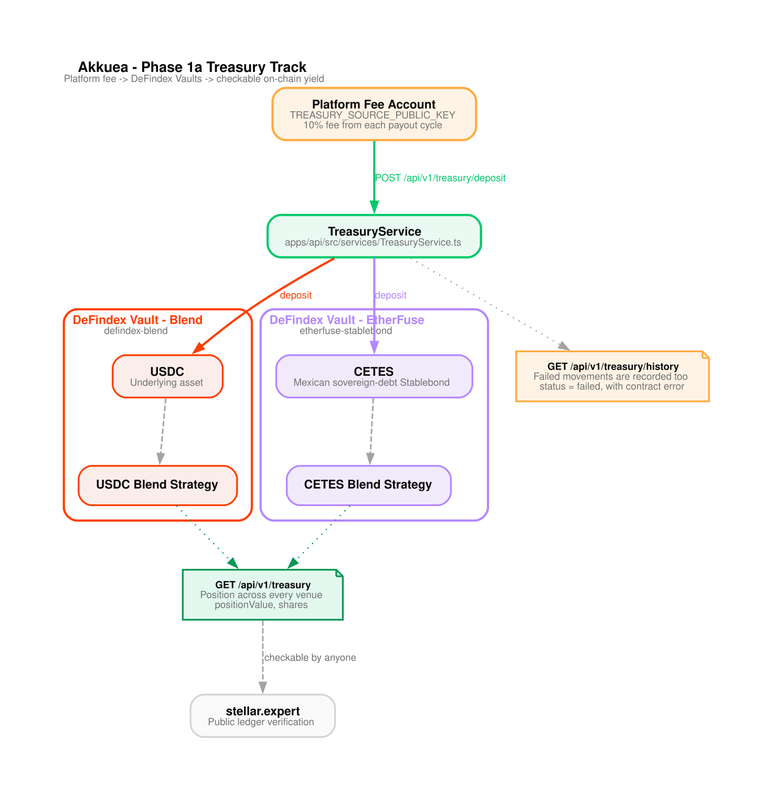

# Runbook: Phase 1a Treasury Track (DeFindex + Etherfuse)

**Severity:** Medium — treasury movements are blocked; platform operations are unaffected
**Audience:** On-call operators with the internal operations API key
**Related source:** `apps/api/src/services/TreasuryService.ts`, `apps/api/src/config/treasury.ts`, `apps/shared/src/contracts/defindexVault.ts`

---

## What this track is

The accumulated platform fee sits in a Stellar account. Rather than leave it idle,
it is deposited into two DeFi venues that are already deployed and already audited.
The balance earns a return, and because it settles on chain the whole position is
checkable by anyone against the ledger.

This is treasury management. It is not an exercise in generating activity to point
at, and the UI copy in `apps/webapp/messages/en.json` (`Treasury` namespace) is
written to say exactly that. If that copy is ever edited into something more
promotional, it has drifted from what the system actually does.

Presentation version (vertical, generated by [`scripts/diagrams/`](../../scripts/diagrams/)):



---

## Venues

Both venues are DeFindex Vaults and share one contract interface. Etherfuse does not
publish a direct Soroban mint/redeem interface for Stablebonds; the documented
on-chain path is the DeFindex strategy, which is what this integration uses.

| Venue ID | Vault | Underlying asset | Strategy |
| --- | --- | --- | --- |
| `defindex-blend` | `CBMVK2JK6NTOT2O4HNQAIQFJY232BHKGLIMXDVQVHIIZKDACXDFZDWHN` | USDC (`CAQCFVLOBK5GIULPNZRGATJJMIZL5BSP7X5YJVMGCPTUEPFM4AVSRCJU`) | `USDC Blend Strategy` |
| `etherfuse-stablebond` | `CBIS5TEMTNNOTBE3WXPQUAGUEDYZZVIWAKTXEQCOUJ34OJJ3FJ5NLF2P` | CETES (`CC72F57YTPX76HAA64JQOEGHQAPSADQWSY5DWVBR66JINPFDLNCQYHIC`) | `CETES Blend Strategy` |

Both addresses are **testnet**, taken from the upstream deployment registry at
<https://github.com/defindex-io/stellar-contracts/blob/main/public/testnet.contracts.json>.

CETES is Etherfuse's tokenized Mexican sovereign-debt Stablebond. The mainnet
Etherfuse strategies (CETES, USTRY, TESOURO) are listed in the same registry's
`mainnet.contracts.json`, but mainnet **vaults** are deployed per partner through
the DeFindex factory, so there are no committed mainnet defaults. Supply them with:

```
TREASURY_DEFINDEX_BLEND_VAULT_ID=C...
TREASURY_DEFINDEX_BLEND_ASSET_ID=C...
TREASURY_ETHERFUSE_VAULT_ID=C...
TREASURY_ETHERFUSE_ASSET_ID=C...
```

### Verification transcript (2026-08-18, testnet)

The committed addresses were confirmed against the deployed contracts, not against
documentation:

```
$ stellar contract invoke --network testnet --id CBMVK2JK... -- get_assets
[{"address":"CAQCFVLOBK5GIULPNZRGATJJMIZL5BSP7X5YJVMGCPTUEPFM4AVSRCJU",
  "strategies":[{"address":"CALLOM5I...","name":"USDC Blend Strategy","paused":false}]}]

$ stellar contract invoke --network testnet --id CBIS5TEM... -- get_assets
[{"address":"CC72F57YTPX76HAA64JQOEGHQAPSADQWSY5DWVBR66JINPFDLNCQYHIC",
  "strategies":[{"address":"CCP4RBDW...","name":"CETES Blend Strategy","paused":false}]}]

$ stellar contract invoke --network testnet --id CBIS5TEM... -- fetch_total_managed_funds
[{"asset":"CC72F57Y...","idle_amount":"30000000","invested_amount":"2000228743",
  "strategy_allocations":[{"amount":"2000228743","paused":false,"strategy_address":"CCP4RBDW..."}],
  "total_amount":"2030228743"}]
```

The contract bindings in `apps/shared/src/contracts/generated/defindexVault.ts` are
generated from the deployed WASM with `stellar contract bindings typescript`, so the
interface in this repo is the interface the chain exposes.

---

## Configuration

| Variable | Purpose |
| --- | --- |
| `TREASURY_SOURCE_PUBLIC_KEY` | Account holding the platform fee. Falls back to `STELLAR_ADMIN_PUBLIC_KEY`. |
| `TREASURY_SOURCE_SECRET` | Signing key for deposits/withdrawals. Falls back to `STELLAR_ADMIN_SECRET`. |
| `OPERATIONS_BACKEND_CREDENTIAL` | Value of the `x-internal-api-key` header required for movements. |
| `STELLAR_NETWORK` | `testnet` or `mainnet`; selects the venue defaults. |
| `STELLAR_RPC_URL` | Soroban RPC endpoint. |

Read endpoints work with only `TREASURY_SOURCE_PUBLIC_KEY` set. Without a public key
the API still reports vault totals but the platform's own position reads as zero.

---

## Endpoints

Read-only, no auth (the data is public on the ledger anyway):

```
GET /api/v1/treasury                    # position across every configured venue
GET /api/v1/treasury/venues/:venue      # one venue
GET /api/v1/treasury/history?limit=20   # recorded movements and snapshots
```

Admin, requires `x-internal-api-key`:

```
POST /api/v1/treasury/deposit   {"venue":"defindex-blend","amount":25,"slippageBps":50}
POST /api/v1/treasury/withdraw  {"venue":"defindex-blend","amount":25,"slippageBps":50}
```

`amount` is in whole units of the venue's underlying asset. `slippageBps` defaults to
50 (0.5%) and is capped at 1000.

---

## Symptoms and responses

Every failure below is a typed contract error decoded from the chain, not a guess.
The API surfaces the contract error name and code in `details.venueError` and
`details.contractErrorCode`, so the response says exactly which contract rejected the
call and why.

| API code | HTTP | Contract error | What happened | Action |
| --- | --- | --- | --- | --- |
| `TREASURY_VENUE_PAUSED` | 503 | `StrategyPaused` (144), `StrategyPausedOrNotFound` (141) | DeFindex paused the strategy, usually as an emergency measure | Do not retry. Check DeFindex status; funds already deposited are still in the vault and can normally still be withdrawn. |
| `TREASURY_INSUFFICIENT_VENUE_LIQUIDITY` | 409 | `InsufficientManagedFunds` (114), `UnwindMoreThanAvailable` (128), `AmountOverTotalSupply` (124) | The withdrawal is larger than the venue can service right now | Retry with a smaller amount, or wait for Blend liquidity to recover. |
| `TREASURY_INSUFFICIENT_BALANCE` | 409 | SAC `BalanceError` (10), `InsufficientBalance` (111) | The treasury account does not hold enough of the asset | Confirm the platform fee balance before retrying. |
| `TREASURY_TRUSTLINE_MISSING` | 409 | SAC `TrustlineMissingError` (13) | The treasury account has no trustline for USDC/CETES | Establish the trustline, then retry. This is the first failure a brand-new treasury account hits. |
| `TREASURY_ASSET_NOT_AUTHORIZED` | 409 | SAC `BalanceDeauthorizedError` (11) | The issuer has not authorized the account to hold the asset | Contact the issuer. |
| `TREASURY_AMOUNT_REJECTED` | 422 | `AmountBelowMinDust` (451), `InsufficientAmount` (117) | Amount below the venue's minimum | Increase the amount. |
| `TREASURY_SLIPPAGE_EXCEEDED` | 409 | `UnderlyingAmountBelowMin` (452), `BTokensAmountBelowMin` (453) | The movement would settle below the slippage floor | Retry with a wider `slippageBps`. |
| `TREASURY_DEADLINE_EXPIRED` | 409 | `DeadlineExpired` (421) | The strategy's deadline passed mid-flight | Retry. |
| `TREASURY_UNAUTHORIZED` | 403 | `Unauthorized` (130) | The configured key is not permitted for this operation | Check `TREASURY_SOURCE_SECRET`. |
| `TREASURY_VENUE_REJECTED` | 502 | `ExternalError` (422), `SupplyNotFound` (455), `StrategyInvestError` (143) | Blend itself rejected the call | Check Blend pool status. A Blend-side pricing failure surfaces here. |
| `TREASURY_VENUE_ERROR` | 502 | anything else | An unmodelled venue failure | Read `details.contractErrorCode` and add a mapping if it recurs. |
| `TREASURY_VENUE_NOT_CONFIGURED` | 503 | — | No addresses for this venue on this network | Set the env vars above. |
| `TREASURY_SOURCE_NOT_CONFIGURED` | 503 | — | No signing key | Set `TREASURY_SOURCE_SECRET`. |
| `TREASURY_VENUE_ASSET_MISMATCH` | 502 | — | The configured vault does not manage the configured asset | The vault or the config changed. Re-verify addresses against the registry before moving any funds. |

### A note on price staleness

These two vaults are single-asset. Their deposit and withdraw paths do not consult a
price oracle — confirmed by simulating a real deposit against the deployed testnet
vault and reading the call tree, which contains only balance reads, a token transfer
and the strategy call. There is therefore no staleness check to perform on this path.
A Blend-side pricing failure would arrive as a strategy `ExternalError` and is mapped
to `TREASURY_VENUE_REJECTED`.

This is unrelated to the platform's own valuation oracle; see
[`runbook-oracle-failure.md`](./runbook-oracle-failure.md) for that.

---

## Failed movements are recorded

A rejected deposit is written to `treasury_transactions` with `status = 'failed'` and
the contract error, before the error is returned to the caller. `GET /history`
therefore shows attempts that did not land, not only the ones that did. Do not delete
these rows to tidy up a report — a history that only shows successes is not the
checkable record this track exists to produce.

---

## Running the integration tests

These run against the real deployed vaults. Reads are simulations and move no funds;
the deposit test funds a throwaway testnet account via friendbot and simulates a real
`deposit`, which the vault rejects at the token transfer.

```bash
cd apps/api
RUN_TREASURY_INTEGRATION_TESTS=1 bun test src/tests/treasury.integration.test.ts
```

They are opt-in because they need outbound access to Stellar testnet and friendbot,
so the required CI workflows stay hermetic.

### SDK version requirement

`apps/shared` and `apps/api` require `@stellar/stellar-sdk` **>= 14**. On 13.3.0 every
read of the CETES vault fails with `TypeError: Bad union switch: 1` — that SDK cannot
parse the Soroban transaction data the current testnet RPC returns for that contract.
The USDC vault is unaffected, and the Rust CLI reads both fine, so the failure is
purely client-side. 14.0.0 is the verified minimum; the workspace is on `^14.2.0`,
matching `apps/akkuea-land`. `apps/webapp` stays on 13.3.0 — it never talks to these
vaults directly.

Do not downgrade those two packages below 14 without re-checking this.

---

## Making the first deposit

The integration tests exercise the deposit call path against the live vaults but
cannot land a deposit, because that needs the treasury account to actually hold USDC
and CETES. Run the steps below with the treasury key to make the first real deposit
in each venue.

### 1. Confirm the treasury account can hold both assets

A brand-new account has no trustlines, and the first thing a deposit hits is the
token transfer, so this must come first.

```bash
export TREASURY=G...   # TREASURY_SOURCE_PUBLIC_KEY

stellar tx new change-trust --source-account treasury --network testnet \
  --line USDC:GATALTGTWIOT6BUDBCZM3Q4OQ4BO2COLOAZ7IYSKPLC2PMSOPPGF5V56

stellar tx new change-trust --source-account treasury --network testnet \
  --line CETES:GC3CW7EDYRTWQ635VDIGY6S4ZUF5L6TQ7AA4MWS7LEQDBLUSZXV7UPS4
```

Skipping this yields `TREASURY_TRUSTLINE_MISSING` / SAC error `#13`.
Having the trustline but no balance yields `TREASURY_INSUFFICIENT_BALANCE` / `#10`.

### 2. Dry-run the deposit

`--send=no` simulates against the real contract without submitting. Amounts are in
the asset's smallest unit (7 decimals), so `100000000` is 10.0.

```bash
stellar contract invoke --network testnet --source-account treasury --send=no \
  --id CBMVK2JK6NTOT2O4HNQAIQFJY232BHKGLIMXDVQVHIIZKDACXDFZDWHN \
  -- deposit \
  --amounts_desired '["100000000"]' --amounts_min '["99500000"]' \
  --from $TREASURY --invest true
```

A clean simulation returns the amounts deposited and the shares that would be minted.
Any `Error(Contract, #N)` maps to the table above.

### 3. Deposit through the API

Prefer this over the CLI for the real movement: it records the transaction, writes an
audit entry, and returns the explorer link.

```bash
curl -sS -X POST http://localhost:3001/api/v1/treasury/deposit \
  -H "content-type: application/json" \
  -H "x-internal-api-key: $OPERATIONS_BACKEND_CREDENTIAL" \
  -d '{"venue":"defindex-blend","amount":10,"slippageBps":50}'

curl -sS -X POST http://localhost:3001/api/v1/treasury/deposit \
  -H "content-type: application/json" \
  -H "x-internal-api-key: $OPERATIONS_BACKEND_CREDENTIAL" \
  -d '{"venue":"etherfuse-stablebond","amount":10,"slippageBps":50}'
```

Each response carries `txHash` and `explorerUrl`.

### 4. Confirm the position moved

```bash
curl -sS http://localhost:3001/api/v1/treasury | jq '.data.positions[] | {venue, positionValue, shares}'
```

`positionValue` should now be non-zero for both venues, and the same figures should
appear on the treasury panel and on stellar.expert at the `explorerUrl` from step 3.
