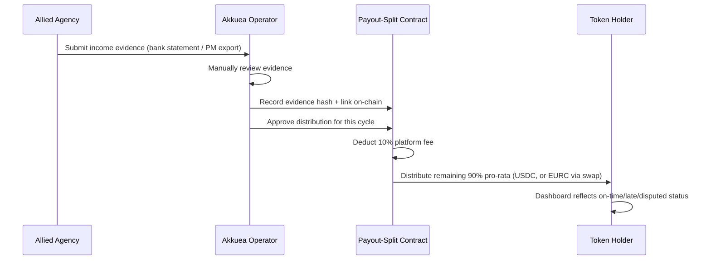

# Product Brief: Akkuea

**Status:** Living strategic document - this file is the canonical source of product direction. Where anything elsewhere in this repository (README, architecture docs, API docs) describes the product differently, this brief and the rest of `docs/strategy/` take precedence. Technical docs outside `docs/strategy/` describe what is built; this folder describes what Akkuea is *for* and where it is going.

---

## Executive Summary

Someone who doesn't have enough capital to buy a house outright but wants real estate exposure has almost no honest way to get it today - the alternatives are staying out of the market entirely, or an informal private deal with no shared record of what's owed. On the other side, small and mid-size real estate agencies and property managers have rental income to offer but no lightweight way to open it to outside investors without a multi-month legal and engineering build they don't have the capital or time for.

Akkuea's near-term product is a **tokenization-as-a-service pilot**: a Soroban-based product that lets one allied real estate agency issue a tokenized right to a share of a specific property's rental income. Investors buy in at whatever size they choose, and earn proportionally to what they invested. Distribution runs through Akkuea's own payout-split contract, gated by a minimum-defensible whitelist, and backed by human-reviewed income evidence rather than an unverifiable self-report. Akkuea takes a 10% fee from each distributed income cycle for operating the infrastructure - transparent, visible on-chain, sized to sustain the business without eating into what makes the investment attractive.

It exists because Stellar's low-fee rails plus already-audited building blocks make this buildable by a small team in a realistic timeframe. The moat is not novel cryptography - it is choosing verified, self-serve infrastructure over building everything from scratch, and being honest about what "trustless" actually means here.

The pilot runs in two tracks: a **testnet track** where the product itself gets built and hardened, and a **mainnet track** where verified integrations go live with one real allied agency and real investor capital. It is deliberately scoped to one ally, one currency, and a non-transferable token in this phase - a single validated pilot is worth more right now than premature platform infrastructure.

> This is a narrower, more disciplined scope than the fractional-equity-plus-lending-pool platform described elsewhere in this repository's technical documentation (see [Relationship to the existing platform build](#relationship-to-the-existing-platform-build) below). That existing build is a real, working system - it simply predates this strategic scoping and is not the pilot's critical path.

---

## The Problem

**For the investor:** access to real estate income below full-property-purchase size is scarce and mostly informal - a spreadsheet and a handshake, or nothing at all. Someone who wants exposure to real estate but can't or doesn't want to buy a whole property has no honest, small-ticket path in.

**For the agency/property manager:** raising capital against a property's income stream today means either a bank loan (collateral-heavy, slow, doesn't share upside) or private off-market deals with individual investors (informal, no shared record, no auditability, doesn't scale past a handful of relationships). Building a compliant tokenization stack in-house is out of reach for an agency this size - it is a multi-month engineering and legal undertaking, not their core business.

**Status quo cost:** capital stays locked to whoever the agency already knows personally, at deal sizes and disclosure standards set by trust rather than evidence - and investors below a certain check size are shut out entirely.

---

## The Solution

A Soroban-based tokenization pilot, scoped to one allied agency:

- The agency's rental-income right for a specific property is issued as a SEP-41-style token representing a **revenue-participation claim** - not fractional equity or title, which carries different legal exposure. The exact legal classification is not yet settled (see [Known Risks](#known-risks--open-questions)).
- **The token is non-transferable in this phase.** No secondary market during the pilot. This removes an entire class of implementation risk (holder-snapshot logic, pro-rata disputes from mid-cycle transfers) and is a deliberate scope cut to protect delivery time, not a permanent design decision.
- Monthly income evidence (bank statement, property-management export, or equivalent) is submitted by the ally and manually reviewed before the payout-split contract executes a distribution. The evidence itself is referenced on-chain as a link plus a cryptographic hash - not just described in a dashboard - so "auditable" is a property of the contract, not a claim in this document. This is disclosed as **verifiable/auditable, not "trustless"**: the trust boundary is honestly drawn at human review of retained, hashed evidence, not eliminated by cryptography.
- Akkuea takes a **10% fee on each distributed income cycle**, deducted by the payout-split contract before the remaining 90% is distributed pro-rata to token holders. The fee is visible on-chain, not negotiated case by case.
- Investor onboarding runs through a minimum-defensible whitelist: manual identity review gating a simple on-chain approved/not-approved contract, not a general compliance product. Investors hold their own tokens via a standard Stellar wallet (Freighter or equivalent) - no custodial layer is built.
- Distribution execution is handled entirely by **Akkuea's own payout-split contract**, gated by manual approval of reviewed evidence (optionally extensible to a lightweight two-signer approval - operator plus ally - using Soroban's native multi-sig auth, without an external service). No external escrow vendor is used in this flow (see [`integration-decisions.md`](integration-decisions.md) for why a candidate was evaluated and rejected).
- Settlement is in **USDC** by default. Investors may opt into **EURC**, resolved by an on-chain swap from USDC to EURC at payout time. The USDC-only path ships and gets validated first; EURC support is a fast-follow within the mainnet track, not a v1 blocker.
- The investor-facing dashboard is **read-only**, built directly off on-chain events and RPC - no investor accounts, no separate database. It shows each cycle's status (on-time / late / disputed / not received) against an explicit expected date, not just a final number, so a skeptical investor sees a pattern of reliability rather than an isolated data point. The same read-only model surfaces the ally-facing evidence-submission state (submitted → in review → approved/rejected, with a reason on rejection) and an explicit escalation state if the ally goes two cycles without reporting.

### Sequence: monthly income distribution cycle

### Akkuea Land: the visual companion, not a separate product

[`apps/akkuea-land`](../../apps/akkuea-land) - the tile-based property simulation already built in this monorepo - is kept and repositioned as an **educational/visual onboarding tool**, not a parallel product line. Its mechanics (buy a property, collect rental income over time, claim it, trade on a marketplace) are a close conceptual mirror of the real pilot flow (buy a participation token, income accrues from a real property, evidence gets reviewed, distributions get claimed). It exists to let a prospective investor or ally *feel* the mechanics of the real pilot in a low-stakes, playable form before they put real capital in. It is explicitly not the fractional-equity/lending product described in the existing technical docs - see [`docs/game/`](../game/) for its own documentation, now framed accordingly.

---

## What Makes This Different

No fabricated technical moat: the underlying primitives (tokenized RWA income rights, escrow-gated payouts, whitelist gates) exist elsewhere in the ecosystem. What differentiates Akkuea at this stage:

- **Honesty about the trust model.** Funded projects elsewhere in the ecosystem have claimed "trustless" operation that does not hold up under inspection. Akkuea states plainly where trust is human-mediated (the hashed, reviewed evidence) and where it is contract-enforced (the payout split, the whitelist gate) - a credibility position, not a hedge.
- **Verifying before integrating, and building custom when nothing actually fits.** Every third-party integration considered for this project (DeFindex, EtherFuse, and a rejected escrow vendor) was checked against primary sources - GitHub repository contents, not marketing claims - before being adopted or discarded. See [`integration-decisions.md`](integration-decisions.md).
- **Deliberate under-scoping.** One ally, one primary settlement currency, a non-transferable token, minimum-defensible KYC, no vault/liquidity layer at launch. The differentiator at this stage is shipping a real, working, honest pilot before building anything speculative.

---

## Who This Serves

**Primary: the investor priced out of direct real estate ownership.** Wants real estate exposure without the capital, financing, or operational burden of buying a property outright - invests an amount that fits their budget and earns proportionally to what they put in, with an actual on-chain record of what was collected and distributed. Not eliminated risk - visible and auditable risk, clearly labeled as such.

**Secondary: the allied real estate agency / property manager.** Wants a new way to raise capital against income they already collect, without building or operating any of the technology themselves, and without taking on legal exposure heavier than a revenue-participation agreement.

---

## Success Criteria

Outcome metrics (depend on landing a real ally and real investors - adjust once a specific ally conversation exists):

- One real estate agency/property manager signed under the 10% rev-share pilot agreement.
- At least one property's rental-income right tokenized and live on mainnet.
- At least five outside investors holding the income-participation token, with a minimum capital-mobilized target to be set once deal size is known - headcount alone is not a sufficient success signal.
- At least three consecutive monthly payout cycles executed on-chain with zero disputed distributions.
- Time from pilot agreement signed to first on-chain payout under 60 days - the first milestone of a roughly 4-month validation window (60 days to first payout, plus two more cycles to reach the 3-cycle criterion above), not the single number that defines the pilot.

Engineering/output metrics (what the build itself must hit, independent of whether an ally is signed yet):

- Full contract suite (income token, whitelist gate, payout-split logic) deployed and exercised end-to-end on testnet, with test coverage on all three contracts, before any mainnet integration work begins.
- Defined gas/fee cost per payout transaction, measured on testnet.
- Whitelist-review and evidence-review turnaround time (SLA) defined and tracked.

---

## Scope

**In - Testnet track (product build):**
- Income-participation token contract (SEP-41-style, non-transferable in this phase, scoped to the pilot ally)
- Whitelist/approval contract (manual review-backed, approved/not-approved)
- Payout-split contract: computes the 10% platform fee, then distributes the remainder pro-rata against human-reviewed, hashed income evidence, over a fixed holder set (no snapshot logic needed given non-transferability)
- Read-only dashboard: ally submits monthly evidence (link + hash), operator reviews/approves, investors view holdings, distributions, and evidence reference/status - no accounts, no database, driven off on-chain state
- Full local/testnet dev and test cycles completed before mainnet work starts

**In - Mainnet track (integrations + real pilot):**
- Verified contracts deployed to mainnet, including Akkuea's own payout-split, whitelist, and token contracts - no external escrow service in this flow
- USDC as the live settlement asset; EURC-via-swap as a fast-follow once the USDC path is validated
- Real pilot ally and real investors onboarded under the signed rev-share agreement
- At least the payout-cycle count defined in Success Criteria executed for real

**Also in - Phase 1a, Treasury track (runs in parallel, see [`roadmap.md`](roadmap.md)):**
- Depositing the accumulated platform fee into already-audited, already-deployed DeFi infrastructure (DeFindex, EtherFuse) to generate real, verifiable on-chain activity early, independent of whether a pilot ally is signed yet.

**Out (explicit, for this phase):**
- Token transferability / secondary market (deferred - revisit post-pilot)
- DeFindex vault/liquidity layer for the income tokens themselves (confirmed real and audited, but only supports pre-built on-chain DeFi strategies, not custom off-chain real-estate yield - deferred to Phase 2; the treasury use of DeFindex is different and is in-scope now, see Phase 1a above)
- Multi-tenant "as-a-service" platform for multiple agencies (only after this pilot proves demand)
- General-purpose compliance/KYC engine or custodial layer
- Fractional equity or title tokenization - a different, heavier legal category than the income-right chosen here (this is also why the existing fractional-shares contract described in this repo's technical docs is not the pilot's contract)
- Any RWA-tokenization integration not independently verified to actually run on Stellar
- Automated/API-based yield-oracle feed - pilot uses human-reviewed, hashed evidence; automation is a Phase 2 upgrade once a specific ally's tooling is known

---

## Known Risks & Open Questions

1. **No pilot ally is under contract yet.** The entire model depends on landing one.
2. **Legal instrument undefined.** What off-chain document makes the token an enforceable revenue-participation right - and whether an SPV is needed - is unresolved. Calling it a "revenue-participation claim" rather than equity does not by itself change securities-law exposure; a token sold to third parties with an expectation of return from a third party's efforts is a plausible Howey-test candidate regardless of label. Needs legal counsel before real investor capital moves.
3. **Target jurisdiction resolved by sequencing, not fully closed.** This phase stays informal, Stellar-native, and does not depend on any jurisdiction formalization. Phase 2 targets Brazil under CVM Resolução 88 - see [`roadmap.md`](roadmap.md) for detail.
4. **Investor illiquidity.** With the token non-transferable in this phase, an investor's capital is committed for the full cycle with no secondary market - a real adoption friction, not just a minor caveat.
5. **Exit mechanism undefined.** What happens if the ally exits or stops operating the property mid-cycle, with investors already holding tokens, has no answer yet.
6. **The yield-evidence review is a manual, human bottleneck.** It is the honest interim answer to the oracle problem, but it does not scale past one ally and depends entirely on operator availability to review evidence every month.
7. **The fund-release approval mechanism is currently a single admin key, with no built-in second-party check.** A two-signer model (operator + ally) is proposed as a cheap native addition, not yet implemented.

---

## Relationship to the existing platform build

This repository already contains a substantially built platform: a `defi-rwa` Soroban contract with fractional property-share tokenization *and* a collateralized DeFi lending protocol (pools, oracle-based valuation, liquidation), a general KYC engine, and a full tile-based property game (`apps/akkuea-land`). That work is real, deployed to testnet, and documented in detail under `docs/api/`, `docs/architecture/`, `docs/deployment/`, and `docs/operations/`.

It predates this brief's scoping and is **not the pilot's critical path**. The decision recorded here and in [`decision-log.md`](decision-log.md) is:

- The pilot (this brief) uses its own, smaller contract surface - an income-participation token, a whitelist, and a payout-split contract - not the existing `defi-rwa` fractional-shares-plus-lending contract.
- The existing lending pool and fractional-equity tokenization are **not part of the current roadmap** (see [`roadmap.md`](roadmap.md)); they remain in the codebase and are documented as-is for anyone building on them, but no active pilot work depends on them.
- `apps/akkuea-land` is kept and repositioned as the pilot's visual/educational companion (see above) rather than a separate product track.

Anyone reading `docs/api/`, `docs/architecture/system-architecture.md`, or `docs/deployment/` should understand those documents describe the **existing platform build**, not the pilot's contract surface. Each of those documents links back here.

---

## Documentation & Quality Standard

Every downstream artifact in this project's documentation - architecture docs, API references, operational runbooks, pitch materials - is held to a professional bar: clearly structured, precisely defined, and illustrated with proper diagrams (mermaid sequence and architecture diagrams for contract and integration flows) rather than prose-only descriptions. This is a standing requirement, not a one-time polish pass.

---

## See also

- [`roadmap.md`](roadmap.md) - Phase 1a/1b/2 roadmap, jurisdiction strategy, partnership targets
- [`integration-decisions.md`](integration-decisions.md) - the verification matrix behind every third-party integration decision
- [`decision-log.md`](decision-log.md) - chronological record of how this strategy was arrived at
- [`recommendations.md`](recommendations.md) - independent analysis and suggested next moves
- [`../design-system/`](../design-system/) - the visual/interaction system this product is built on
