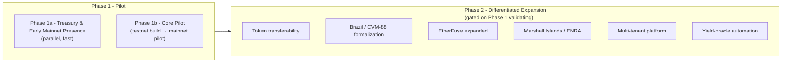

# Roadmap: Phase 1 (Pilot) → Phase 2 (Differentiated Expansion)

Two structures coexist here and answer different questions:

- **Testnet → Mainnet** is about _deployment environment_ within Phase 1: build and harden on testnet first, then take verified integrations and real capital to mainnet.
- **Phase 1 → Phase 2** is about _product scope and ambition over time_: prove the pilot before investing in anything harder to undo.

---

## Phase 1a - Treasury & Early Mainnet Presence

Runs in parallel with Phase 1b, not sequentially before or after it. Goal: real, verifiable on-chain activity on mainnet almost immediately, using only already-audited, already-deployed contracts - no new code.

- Deposit the accumulated platform fee into **DeFindex's Blend strategy** and/or **EtherFuse Stablebonds**.
- Documented honestly as treasury management that happens to generate early, checkable on-chain history - not framed around "generating metrics" for its own sake, even though that credibility benefit is part of the real motivation. Obscuring the actual reason would repeat the exact failure pattern this project's own research rejected in Spydra (see [`integration-decisions.md`](integration-decisions.md)): the honest framing is judged equally or more effective for the same goal, since the activity itself is real and checkable either way.
- Does not block or compress Phase 1b's timeline.

## Phase 1b - Core Pilot

Unchanged from the scope in [`product-brief.md`](product-brief.md): one ally, one currency (USDC), non-transferable token, Akkuea's own escrow-gated payout-split contract, minimum-defensible KYC, Stellar-native end to end.

**Testnet track** isolates all product-logic risk (contract correctness, whitelist flow, payout-split logic, dashboard UX) from integration and real-money risk - cheap to iterate, cheap to get wrong, no mainnet fees, no real ally or investor exposed to bugs.

**Mainnet track** is where Akkuea's own verified contracts and real capital enter, deliberately sequenced after the testnet track proves the core logic works.

Fast by design - the point is to validate that a real ally and real investors will actually use this, before investing in anything harder to undo. Success is measured by the Success Criteria in `product-brief.md`, not by how complete the product feels.

---

## Phase 2 - Differentiated Expansion

Only after Phase 1 validates. A longer, more extensive build aimed at genuinely solving the problem at depth and with high reliability, not just proving the concept. Each item below is gated on verification before being treated as committed architecture - this project's standing rule.

### DeFindex - liquidity/yield layer for the income tokens

Verified real, audited (OtterSec), mainnet-deployed. `/strategies` in `defindex-io/stellar-contracts` (formerly `paltalabs/defindex`) only contains pre-built on-chain DeFi strategies (`blend`, `soroswap`, `hodl`, `xycloans`, `fixed_apr`, `core`, `external_wasms`, `unsafe_hodl`) - no path for a custom off-chain real-estate-yield strategy without building a new strategy module against their `core` trait. That module is Phase 2 engineering, once there is real, audited on-chain payout history from Phase 1b to build a strategy against. (Its Phase 1a treasury use is unrelated and already in scope - see above.)

### EtherFuse - treasury/yield instrument, not a tokenization SDK

Verified real and genuinely Stellar-compatible: shipped on Stellar in 2025, active on-chain trading (354 holders, ~69.8M supply, 1.67M trades on the CETES issuer as of Aug 2026 per stellar.expert), Reflector DAO carries price feeds, Anchorage Digital added institutional custody in June 2026, SDF participated in EtherFuse's 2024 seed round. EtherFuse issues **Stablebonds** (tokenized sovereign treasury debt - Mexican CETES, US Treasuries, others), not a general-purpose RWA-tokenization SDK. It is a candidate treasury/yield instrument for idle platform funds (e.g., the accumulated 10% platform fee), alongside DeFindex - not a replacement for Akkuea's own payout-split/whitelist contracts.

### Token transferability / secondary market

Revisit once a real holder base exists from Phase 1b. Deferred because holder-snapshot and pro-rata-on-transfer logic is real implementation risk not worth taking on before a pilot proves demand.

### Jurisdiction formalization: Brazil, CVM Resolução 88

**Strongest regulatory fit found.** CVM-88 (under active revision since Sept 2025 to formalize tokenization) lets small Brazilian issuers (revenue ≤R$40M) raise up to R$15M/year via registration-exempt offerings, provided distribution runs through an already CVM-authorized platform.

Real-estate-specific CVM-authorized platforms exist: **Urbe.Me** (CVM-registered real-estate crowdfunding since ~2014), **Bloxs** (partnered with securitizer Toke Invest on a "100% blockchain" securitization stack, actively issuing tokenized real-estate receivables), **INCO, Glebba, NaPlanta**. This corrects an earlier research pass that only surfaced generalist platforms (Mercado Bitcoin, LIQI). None of these platforms' underlying chain is publicly disclosed - direct outreach is needed.

**Settlement path materially improved:** Circle's CCTP V2 added native Stellar support (May 2026) and already supports XDC. If the eventual Brazilian partner runs on **XDC** (like LIQI), USDC moves natively between Stellar and that platform via CCTP with no bridge - Stellar-native settlement stays intact end to end. **XRP Ledger (Mercado Bitcoin's chain) is not CCTP-covered** and would need a general message-passing bridge (Axelar or Wormhole - both real, audited, and support XRPL as of 2026, but an added dependency).

**Action item:** reach out to Bloxs directly - most promising given its existing blockchain-forward posture - to ask about their underlying chain and openness to a Stellar-settled partnership, before defaulting to a generalist platform.

**Sequencing decision:** pursue Brazil + an existing licensed platform as the target regulatory path, but explicitly as Phase 2, not a Phase 1 prerequisite. Negotiating a distribution partnership with a regulated platform is itself a slow BD process that could strand the already-verified Stellar-native architecture if required before the pilot can launch.

### Small-country government/institutional partnerships

Nothing found beats the **Marshall Islands'** existing relationship: in Nov–Dec 2025 the RMI government partnered directly with the Stellar Development Foundation and Crossmint to launch **ENRA**, the first on-chain UBI program, disbursing a sovereign bond (USDM1) via Stellar through a wallet called Lomalo (sources: stellar.org press release, CoinDesk). This is a government-to-citizen sovereign bond/UBI rail, not a licensed pathway a private team can plug rental-income tokens into directly - but it is a genuine point of access. **Action item:** explore positioning real-estate RWA as a natural extension of the existing ENRA relationship.

Ruled out: Ukraine (real 2020 SDF MOU, but stale/wartime-complicated), Brazil's LIFT Challenge (large, competitive institutional CBDC process - wrong profile for a small team), UNDP-SDF partnerships (indirect, run through country offices), Vanuatu/Bermuda/Seychelles (no Stellar tie, no evidence of foreign-small-team access). Georgia's Dec 2025 land-registry tokenization MOU is a useful precedent that small governments are open to this kind of deal - but it's with Hedera, not Stellar.

### Multi-tenant tokenization-as-a-service

Generalizing beyond one ally - only once Phase 1 proves demand. Building this for one client now is premature platformization.

### Yield-oracle automation

Moving from human-reviewed evidence toward an API/webhook-verified feed, per-ally, once a specific ally's actual tooling (Airbnb export, property-management API, etc.) is known.

---

## See also

- [`product-brief.md`](product-brief.md) - the pilot itself, problem, solution, scope
- [`integration-decisions.md`](integration-decisions.md) - verification methodology and full matrix
- [`decision-log.md`](decision-log.md) - chronological decision record
